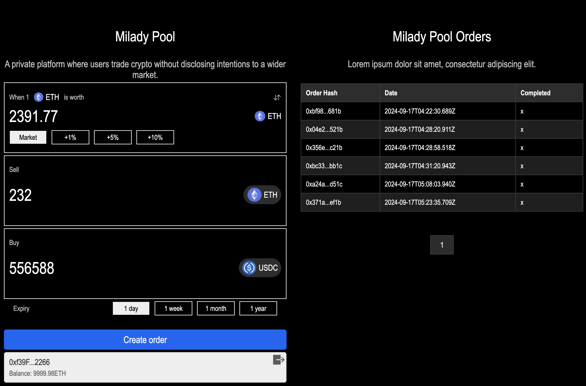

# Milady Pool

Milady Pool is a dark pool, a private platform where users trade crypto without disclosing intentions to a wider market.


## Key Links

-   [Deck](https://docs.google.com/presentation/d/1VKNYl90o_lazJH31P9Q9OY78FQ-3M4cKGnbh8PQDtO8/edit?usp=sharing)

## Background

Milady Pool is a dark pool implementation that leverages what I learned in the Uniswap Hook Incubator and new and old tech like Eigenlayer, Succinct SP1, and Wyvern (OpenSea). My goal was to create smart contract interactions where I could minimize the technical nuances and complexity for the end-user. I used variations of signed messages, hashes, proofs to streamline how people can trade on chain without compromising their privacy.

## Impact

I created a swap router that can interact with v4 without needing the user to transfer tokens into the pool manager before placing their order. The user stores a signed message with an Eigenlayer AVS. The signed message has a permit2 object. When a price is hit onchain, the signed message is sent onchain by an AVS operator. The smart contracts I created can parse the order and the permit2 object to facilitate the swap. Tokens are only transferred from a user's wallet when their order is valid onchain.

## Challenges

1. I wanted to use no-op hooks to obscure the transactions even more. It was quite tricky balancing the token inputs and outputs because I was using permit2 instead of the normal transfer mechanisms in v4. I ended up doing all of the settlement of tokens through a custom router contract instead.

2. I created a simple offchain Succinct SP1 circuit (to create proofs for the orders created in the app) and a Rust server API to interact with the circuit. To add the corresponding Solidity code to verify the orders / proofs / etc. would've taken me a lot longer so I deferred it for now.

## Extensions

#### Hook / Router

-   Better handling of swap details (for permit2, zk proofs)
-   Add fees (take part of the output and swap into ETH)
-   Obscure the swap capabilities through zk proofs (with SP1 and Succinct) (PoC started, ran out of time) and no-op hooks (moved everything into a custom router for now)
-   Add support for EIP-1271 and other signatures

#### Eigenlayer

-   Confirm activity and dispute details for operators, aggregators, etc.
-   Add fee sharing (through a new ERC-20 token that can be staked)
-   Align to AVS node specs
-   Write tests
-   Add multi-chain / cross-chain compatibility

#### Overall

-   Audits, make UI flow better, distribute the database

## Archtecture

### User Interface



The user interface is stored in the `/ui` folder. It is a Next JS app. Milady Pool uses a single page app for users to create and view orders. As a user, you can connect your wallet and create private orders using the user interface.

### Actively Validated Service

The actively validated service (AVS) is responsible for storing, processing, and submitting private orders. It is a Node JS app with a GraphQL API. When orders are created, they are stored in a Postgresql database. The Node JS app also has contract listeners. As events are emitted from the chain the Milady Pool contracts are deployed to, the Node JS app is responsible for processing and submitting relevant orders based on the event.

### Contracts

Contracts called `MiladyPoolOrderManager` and `MiladyPoolRouter` were designed as a Uniswap V4 hook that can process limit orders from the Milady Pool AVS.

### ZKP

This project uses Succint's SP1 to create Zero Knowledge Proofs for the orders created. Integration is pending. A Rust API server and a ZKP circuit is available for use.

## Getting started

Instructions to manually run Milady Pool are listed below. Please note that this code should only be used for testing and should not be used in production.

1. To get started, we will prepare the contracts
2. Run `cd contracts && cp .env.example .env`
3. Run `forge clean && forge build`
4. Start anvil by opening another terminal and running `anvil --host 0.0.0.0`
5. In another terminal, deploy Eigenlayer contracts

Change into `contracts/lib/eigenlayer-contracts` and run the following commands (the other one is old (in eigenlayer-middleware/lib/eigenlayer-contracts))

```sh
forge script script/deploy/local/Deploy_From_Scratch.s.sol --rpc-url http://localhost:8545 \
--private-key 0xac0974bec39a17e36ba4a6b4d238ff944bacb478cbed5efcae784d7bf4f2ff80 --broadcast \
--sig "run(string memory configFile)" -- local/deploy_from_scratch.anvil.config.json
```

6. You should also deploy permit2. It will deploy at `0x000000000022D473030F116dDEE9F6B43aC78BA3`.

```sh
cd contracts/lib/v4-periphery/lib/permit2

forge script script/DeployPermit2.s.sol --rpc-url http://localhost:8545 --private-key \
0xac0974bec39a17e36ba4a6b4d238ff944bacb478cbed5efcae784d7bf4f2ff80 --broadcast -v --via-ir
```

7. You should also deploy the other Uniswap contracts

```sh
cd contracts

forge script script/V4Deployer.s.sol --rpc-url http://localhost:8545 --private-key \
0xac0974bec39a17e36ba4a6b4d238ff944bacb478cbed5efcae784d7bf4f2ff80 --broadcast -v --via-ir
```

8. In another terminal deploy Milady Pool contracts

```sh
cd contracts

forge script script/MiladyPoolDeployer.s.sol --rpc-url http://localhost:8545 --private-key \
0xac0974bec39a17e36ba4a6b4d238ff944bacb478cbed5efcae784d7bf4f2ff80 --broadcast -v --via-ir
```

9. Next, start the operator. Run `cd operator` to change into the AVS server folder
10. Run `yarn` to install all dependencies
11. Run `yarn dev` to start up a GraphQL API, a connection to your database, and an event listener for your contracts
12. For your UI, cd into the `ui` folder
13. Run `yarn && yarn dev`

## Testing

After step 6 from the list above, you can run `forge test --via-ir --rpc-url http://localhost:8545` to run simple tests

<!-- FYI -->

<!-- zero for one true, amount specified > 0, exact input of token 0 for token 1 -->
<!-- zero for one true, amount specified < 0, exact output of token 0 for token 1 -->
<!-- zero for one false, amount specified < 0, exact output of token 1 for token 0 -->
<!-- zero for one false, amount specified > 0, exact input of token 1 for token 0 -->
